# week4-s3-storage

# Week 4: Cloud Storage System with AWS S3

## 📋 Project Overview
This project demonstrates building a production-ready cloud storage system using AWS S3 (Simple Storage Service) with Terraform. It implements security best practices, cost optimization through lifecycle policies, and versioning for data protection.

## 🎯 Objectives
- Build a secure file upload/download system with S3
- Implement bucket policies and lifecycle rules
- Learn AWS storage classes and cost optimization
- Automate infrastructure deployment with Terraform

## 🛠️ Tools & Technologies
- **Terraform** - Infrastructure as Code
- **AWS S3** - Object storage service
- **AWS CLI** - Command-line tool for AWS
- **VS Code** - Code editor
- **Git/GitHub** - Version control

## 📂 Project Structure
```
week4-s3-storage/
├── main.tf              # Main Terraform configuration
├── variables.tf         # Variable definitions
├── outputs.tf           # Output values
├── terraform.tfvars     # Variable values (not tracked in git)
├── .gitignore          # Git ignore file
├── screenshots/         # Documentation screenshots
└── sample-files/        # Test files for upload
```

## 🧠 Key Concepts

### What is S3?
Amazon S3 (Simple Storage Service) is object storage built to store and retrieve any amount of data from anywhere. Unlike traditional file systems, S3 is:
- **Highly Durable**: 99.999999999% (11 nines) durability
- **Scalable**: Store unlimited data
- **Accessible**: Access from anywhere via HTTPS
- **Cost-Effective**: Pay only for what you use

### Storage Classes

1. **STANDARD** - Frequent access, highest cost
2. **STANDARD_IA** (Infrequent Access) - ~50% cheaper, for less frequently accessed data
3. **GLACIER** - ~90% cheaper, for archives (slower retrieval)

### Versioning


Versioning keeps multiple variants of an object in the same bucket. Benefits:
- Recover from unintended user actions
- Recover from application failures
- Maintain archive of objects

### Lifecycle Policies


Automatically transition objects between storage classes based on age:
- Day 0-30: STANDARD storage
- Day 30-90: Move to STANDARD_IA (saves ~50%)
- Day 90-365: Move to GLACIER (saves ~90%)
- Day 365+: Delete automatically

## 📋 Configuration Files

### variables.tf
Defines reusable variables for flexibility.

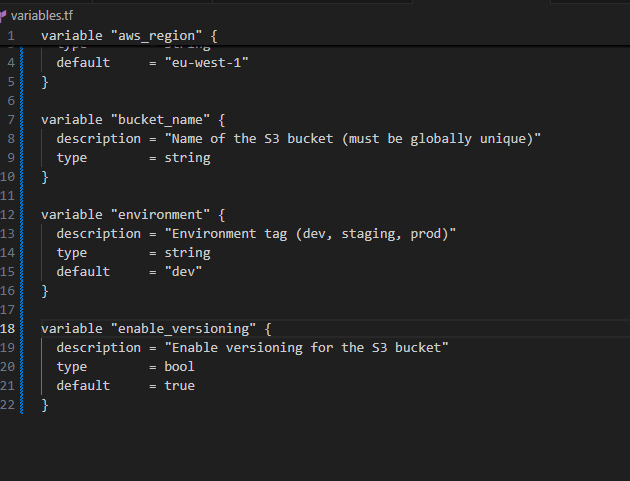

### terraform.tfvars
Contains actual values (excluded from git for security).

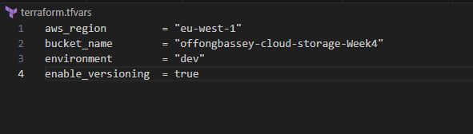

### outputs.tf
Displays important information after deployment.

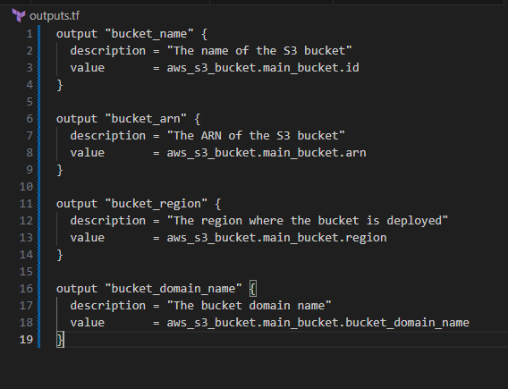

## 🚀 Steps Taken

### Step 1: Configure AWS Provider
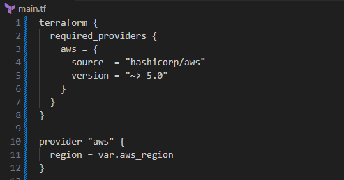

Configured Terraform to use AWS provider version 5.x for eu-west-1 region.

### Step 2: Create S3 Bucket
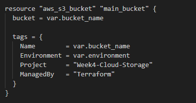

Created S3 bucket with proper tags for organization and cost tracking.

**Key features:**
- Globally unique name
- Tagged for environment tracking
- Managed by Terraform

### Step 3: Enable Versioning
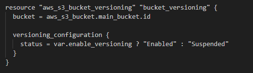

Enabled versioning to protect against accidental deletions and overwrites.

### Step 4: Block Public Access


Implemented 4-layer security to prevent accidental public exposure:
- Block public ACLs
- Block public policies
- Ignore public ACLs
- Restrict public buckets

**Why this matters:** Prevents data breaches from misconfigured permissions.

### Step 5: Enable Encryption


Enabled AES-256 server-side encryption for all objects.

**Security benefit:** Files are encrypted at rest on AWS servers.

### Step 6: Configure Lifecycle Rules
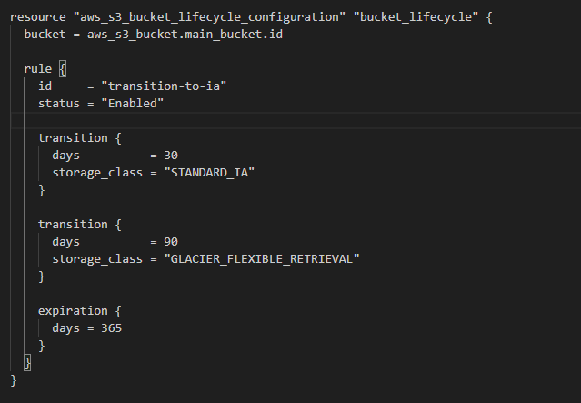

Set up automatic transitions to optimize costs:
```
Day 0-30   → STANDARD ($0.023/GB/month)
Day 30-90  → STANDARD_IA ($0.0125/GB/month) - 45% savings
Day 90-365 → GLACIER ($0.004/GB/month) - 82% savings
Day 365+   → Deleted automatically
```

### Step 7: Set Bucket Policy
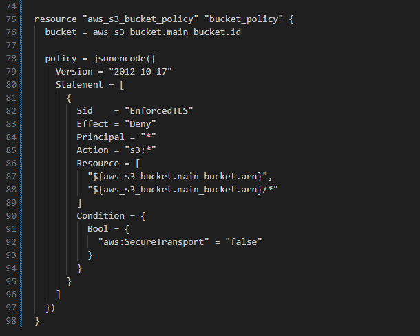

Created policy to enforce HTTPS-only access.

**Security benefit:** All data transfers must be encrypted in transit.

## ✅ Validation & Deployment

### Initialize Terraform
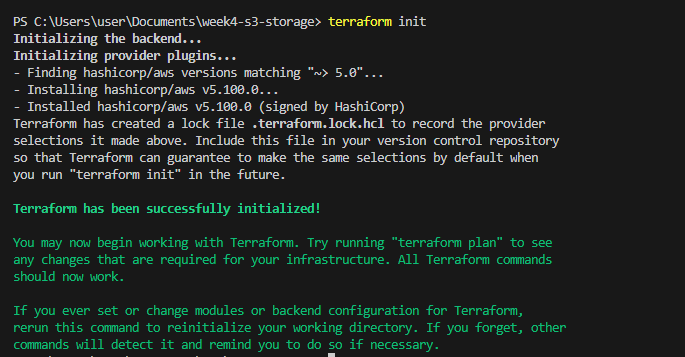
```bash
terraform init
```
Downloaded AWS provider and initialized working directory.

### Validate Configuration
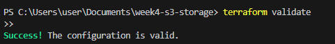
```bash
terraform validate
```
Verified syntax and configuration correctness.

### Plan Deployment
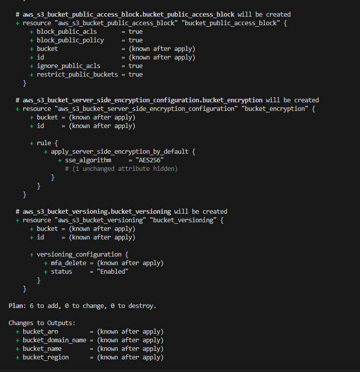
```bash
terraform plan
```
Reviewed resources to be created (6 resources total).

### Apply Configuration
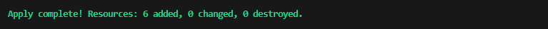
```bash
terraform apply
```
Successfully deployed S3 bucket with all security and lifecycle configurations.

### Outputs
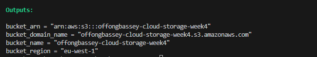

Retrieved bucket information:
- Bucket name
- ARN (unique identifier)
- Region
- Domain name

## 📊 AWS Console Verification

### S3 Console - Bucket Created
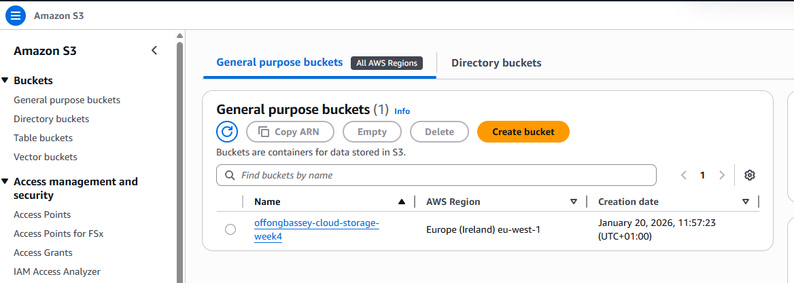

Verified bucket appears in S3 console with correct configuration.

### Bucket Properties


Confirmed:
- ✅ Versioning enabled
- ✅ Encryption enabled (AES-256)
- ✅ Public access blocked

### Lifecycle Rules
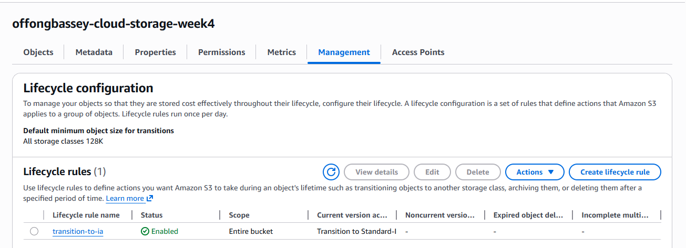

Verified lifecycle rule is active with correct transitions.

## 🧪 Testing File Upload/Download

### Upload Test File
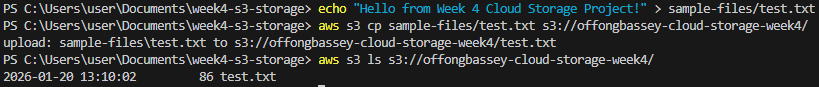
```bash
# Create a test file
echo "Hello from Week 4!" > sample-files/test.txt

# Upload to S3
aws s3 cp sample-files/test.txt s3://YOUR-BUCKET-NAME/
```

### List Files in Bucket
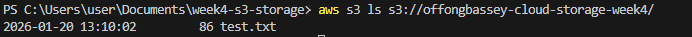
```bash
aws s3 ls s3://YOUR-BUCKET-NAME/
```

### Download File

```bash
aws s3 cp s3://YOUR-BUCKET-NAME/test.txt ./downloaded-test.txt
```

### Test Versioning
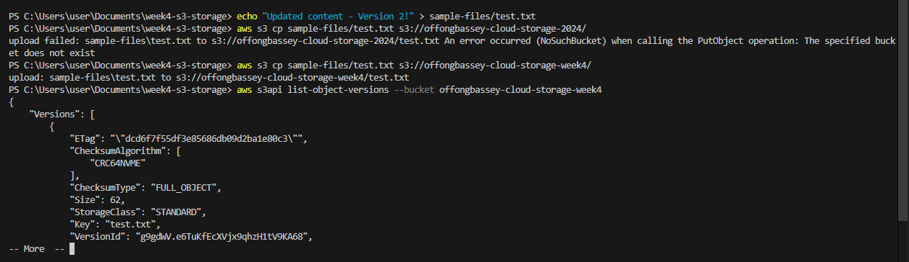
```bash
# Upload same file again (creates new version)
echo "Updated content!" > sample-files/test.txt
aws s3 cp sample-files/test.txt s3://YOUR-BUCKET-NAME/

# List all versions
aws s3api list-object-versions --bucket YOUR-BUCKET-NAME
```

## 💡 Key Learnings

- **S3 is object storage, not a file system** - Different paradigm from traditional storage
- **Bucket names must be globally unique** - Plan naming conventions carefully
- **Storage classes dramatically reduce costs** - Lifecycle policies are essential for cost optimization
- **Security requires multiple layers** - Public access blocks, encryption, and HTTPS-only policies
- **Versioning provides data protection** - Critical for recovering from mistakes
- **Terraform makes infrastructure reproducible** - Same code can create identical infrastructure anywhere

## 🔗 Resources

- [AWS S3 Documentation](https://docs.aws.amazon.com/s3/)
- [Terraform AWS S3 Bucket](https://registry.terraform.io/providers/hashicorp/aws/latest/docs/resources/s3_bucket)
- [S3 Storage Classes](https://aws.amazon.com/s3/storage-classes/)
- [S3 Lifecycle Policies](https://docs.aws.amazon.com/AmazonS3/latest/userguide/object-lifecycle-mgmt.html)

## 📝 Next Steps

Week 5: Serverless Function Deployment with AWS Lambda

## 🧹 Cleanup

To avoid charges, destroy resources when done:
```bash
terraform destroy
```

**Note:** S3 buckets with objects cannot be destroyed by Terraform. Empty the bucket first:
```bash
# Remove all files
aws s3 rm s3://YOUR-BUCKET-NAME --recursive

# Then destroy
terraform destroy
```

---

**Author:** [Your Name]  
**Date:** December 2024  
**Part of:** 12-Week Cloud Computing Project Challenge  
**Repository:** [GitHub Link]